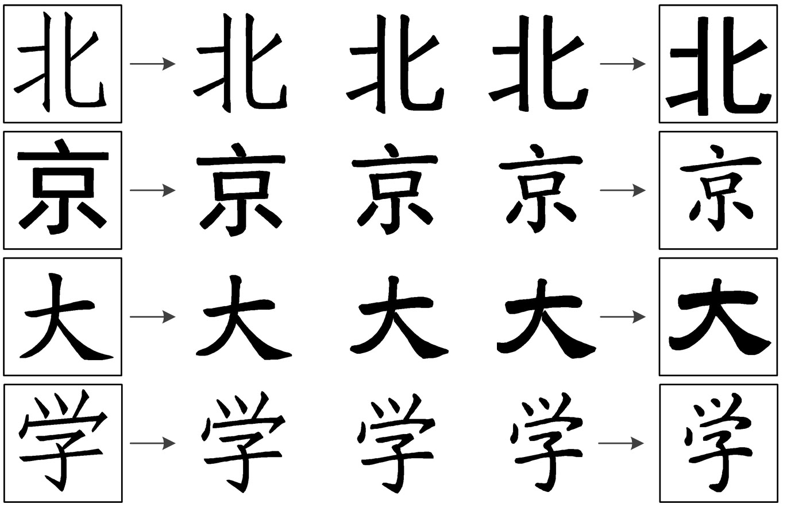
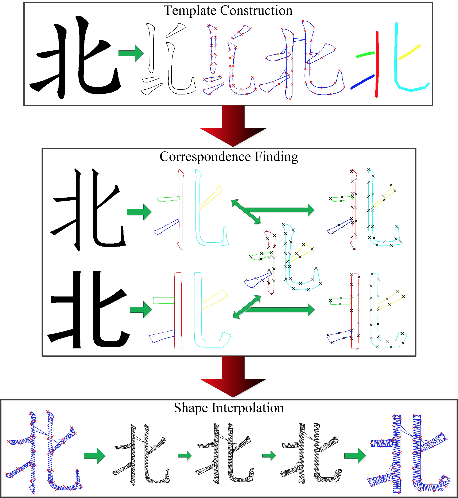
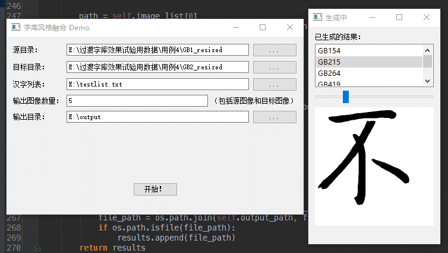

# Font Morphing

## Introduction

C++ implementation of "Automatic shape morphing for Chinese characters"[1].
Graduation Project at ICST, Peking University.

> Given any two styles of fonts, automatic shape morphing technique can produce the morphing process of the two styles.

*demonstration of font morphing [1]*

## Overview

The algorithm is composed of the following procedures:

- template construction
- correspondence finding
- shape interpolation

*algorithm overview [1]*

See my undergraduate thesis for more details on principles and implementations.

## Installation

Dependencies required by the program are:

- OpenCV 2.3 and above
- Eigen
- Fade2D
- SGCPD [2] (provided as a sub-project)

Developed and tested on VS 2010.

## Usage

usage: 	fontmorphing			: use the test data to demonstrate the program.
		fontmorphing <options>	: use the user specified data to do font morphing.
Options are:
	<source dir>				: source image directory. one image file per character.
	<target dir>				: target image directory. one image file per character.
	<char name | char list>		: a character file name, or a list of character file names.
	<output dir>				: output directory of blended character images.
	<morphing ratio>			: 0~1 float.the morphing ratio between the two input fonts.
	<display>					: 'y'|'n'. Whether to display the morphing process.
	
See FontMorphingGUI if you want a graphical user interface.

## References

[1] Lian Z, Xiao J. Automatic shape morphing for Chinese characters[C]//SIGGRAPH Asia 2012 Technical Briefs. ACM, 2012: 2.
[2] Sun H, Lian Z, Tang Y, et al. Non-rigid point set registration for Chinese characters using structure-guided coherent point drift[C]//2014 IEEE International Conference on Image Processing (ICIP). IEEE, 2014: 4752-4756.